# Interpreting Deep Neural Networks with the Package `innsight`

This repository can be used to reproduce the results and figures from the 
paper *"Interpreting Deep Neural Networks with the Package innsight"* submitted 
for the Journal of Statistical Software (JSS). It is structured as follows:

* The R script `Section_4_1.R` covers the example with the penguin dataset 
(only numerical input variables) and reproduces the Figures 7 (a) and (b).

* The R script `Section_4_2.R` covers the example with the melanoma dataset
(images and tabular inputs) and reproduces the Figures 9 (a) and (b). In this
code the weights of an already trained model are used, which are stored in the
folder `additional_files/`. How exactly the model was trained is explained in 
the folder `Melanoma_model_training/`, but requires considerable computer 
power due to the size of the model.

* The R script `Section_5_1.R` includes the simulation study of the implemented 
feature attribution methods regarding the correctness compared with
the reference implementations [**captum**](https://captum.ai/), 
[**zennit**](https://github.com/chr5tphr/zennit), [**innvestigate**](https://github.com/albermax/innvestigate), and 
[**deeplift**](https://github.com/kundajelab/deeplift). It reproduces the
Figures 10 (a) - (c).

* The R script `Section_5_2_and_Appendix_A.R` includes the simulation study of 
the implemented feature attribution methods regarding the runtime compared with
the reference implementations [**captum**](https://captum.ai/), 
[**zennit**](https://github.com/chr5tphr/zennit), [**innvestigate**](https://github.com/albermax/innvestigate), and 
[**deeplift**](https://github.com/kundajelab/deeplift). It reproduces the
Figures 12 (a) and (b), 14, 15, 16, 17, 18.

* The R script `Appendix_B` contains the code to reproduce the differences 
between **innsight** and **innvestigate** explained in Appendix B for the 
LRP &alpha;-&beta;-rule when a bias vector occurs in the model.

After one of these scripts has been executed, the respective Figures are 
saved in the folder `figures`.

Since each reference implementation has different constraints on the 
provided deep learning library and the available packages, the computations 
occur in separated conda environments with the required packages and package 
versions. These conda environments can be created using the R script
`utils/create_condaenvs.R` and are essential for reproducing the 
results. However, the first time you run the code that requires the 
environments, you will be asked if you want to install them.

## Reproduction of the results

### 4.1. Example 1: Penguin dataset

In the first example, the penguin dataset provided by the 
[**palmerpenguins**](https://allisonhorst.github.io/palmerpenguins/) 
package is used and a neural network consisting of a dense layer is trained 
using the [**neuralnet**](https://cran.r-project.org/web/packages/neuralnet/neuralnet.pdf) 
package. To reproduce the results from the paper, run the R script `Section_4_1.R`:

```
Rscript Section_4_1.R
```

The Figures 7 (a) and (b) used in the paper are then saved in the folder `figures/`.

**Figure 7**
<p float="left">
  
  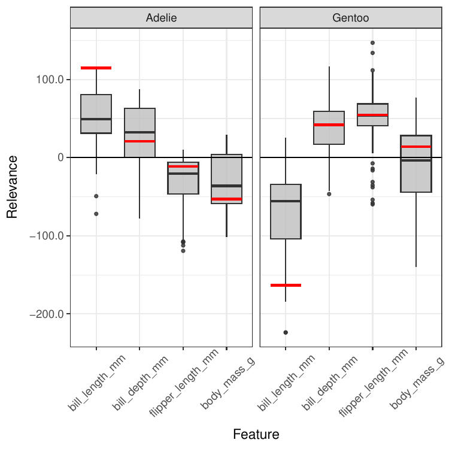 
</p>

### 4.2. Example 2: Melanoma dataset

The second example examines the melanoma dataset from the [Kaggle challenge](https://www.kaggle.com/competitions/siim-isic-melanoma-classification/overview/description) 
in 2020, issued by the society of imaging informatics in medicine (SIIM) and based
on the international skin imaging collaboration (ISIC) archive, the most 
extensive publicly available collection of quality-controlled dermoscopic 
images of skin lesions. This dataset consists of $33.126$ labeled images 
with associated patient-level contextual information, such as the age, gender, 
and image location of the skin lesion or mole. Since this is an extensive 
neural network and complicated high-dimensional data, the definition and 
training of the model is explained in more detail in the folder 
`Melanoma_model_training/`. To reproduce the results, the weights of the 
model stored at `additional_files/melanoma_model.h5` are 
loaded and used. Then, execute the following R-script:

```
Rscript Section_4_2.R
```

This creates the images for Figure 9 from the paper and places them in 
the folder `figures/`.

**Figure 9**
<p float="left">
  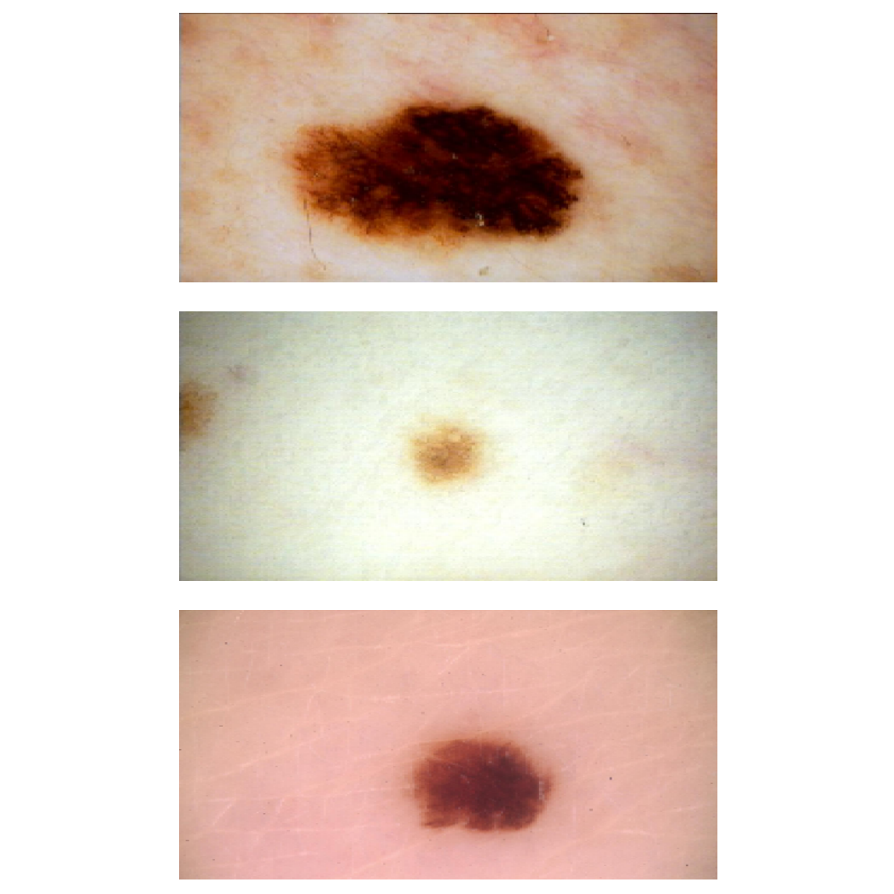
  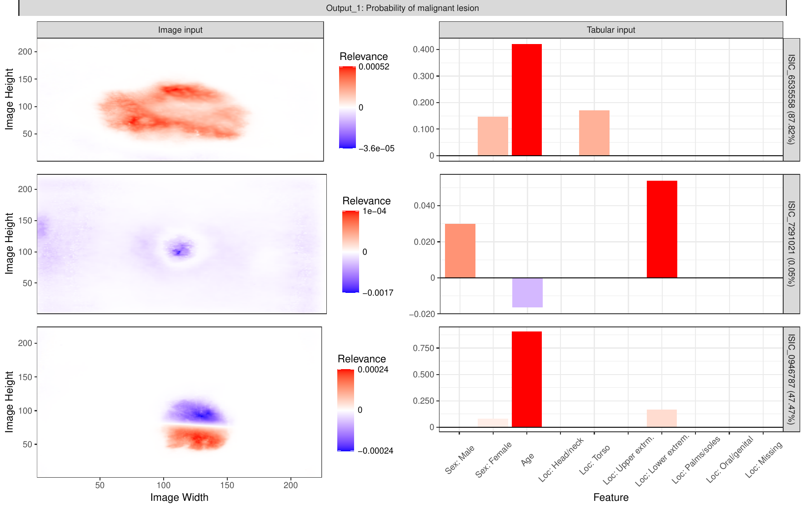 
</p>

### 5. Validation and runtime

In the paper, our package **innsight** was evaluated with the reference 
implementations **zennit**, **captum**, **innvestigate** and **deeplift** 
in terms of correctness of results and runtime on a simulation study with 
shallow untrained models. Each of these simulations takes quite a bit of 
time. The exact details of this simulation can be found in the paper and the 
simulation is run to reproduce the results with the following command:

```
Rscript Section_5_1.R
```

**Note:** Since this simulation takes a lot of time, it can be significantly 
reduced if fewer models than $50$ are created per architecture. This can be 
adjusted with the `num_models` value (e.g., `num_models <- 1`) in the R script 
called above. (By default, the script uses a minimal time-consuming setting)

This creates the images for Figure 10 from the paper and places them in 
the folder `figures/`.

**Figure 10**
<p float="left">
  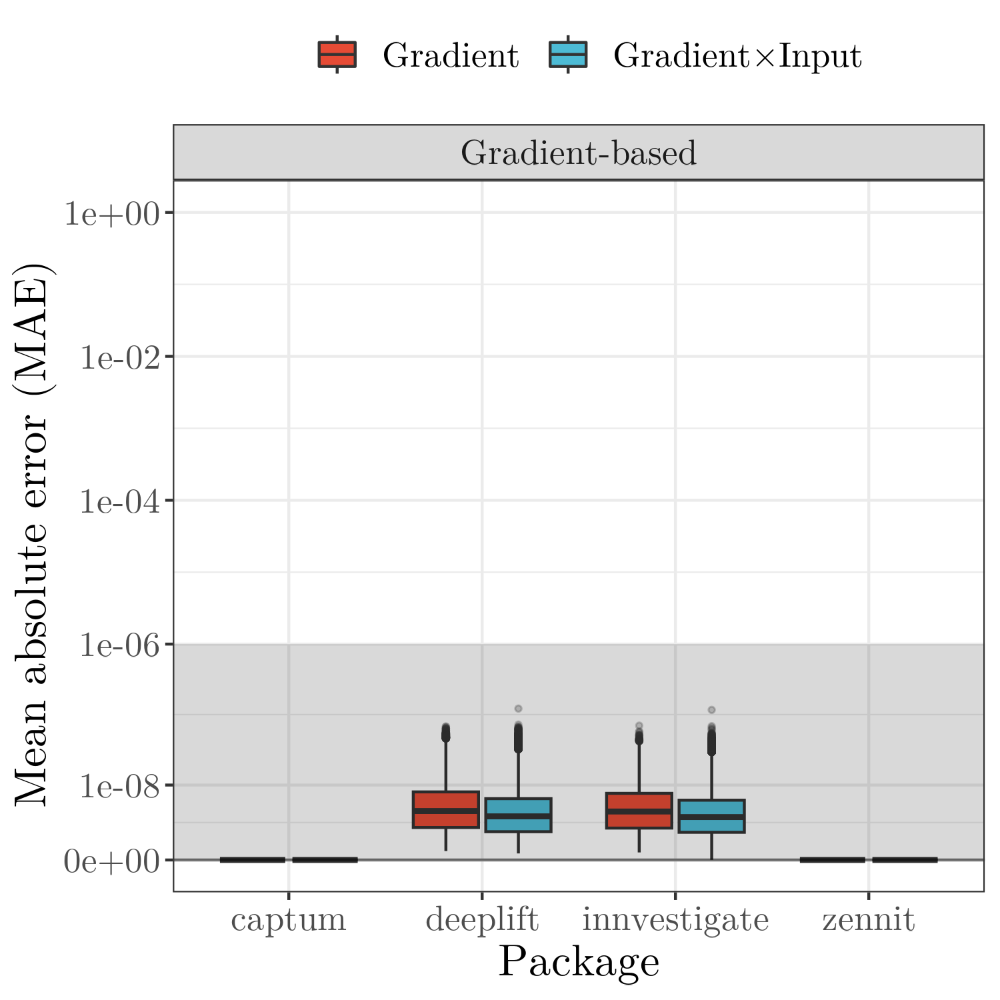
  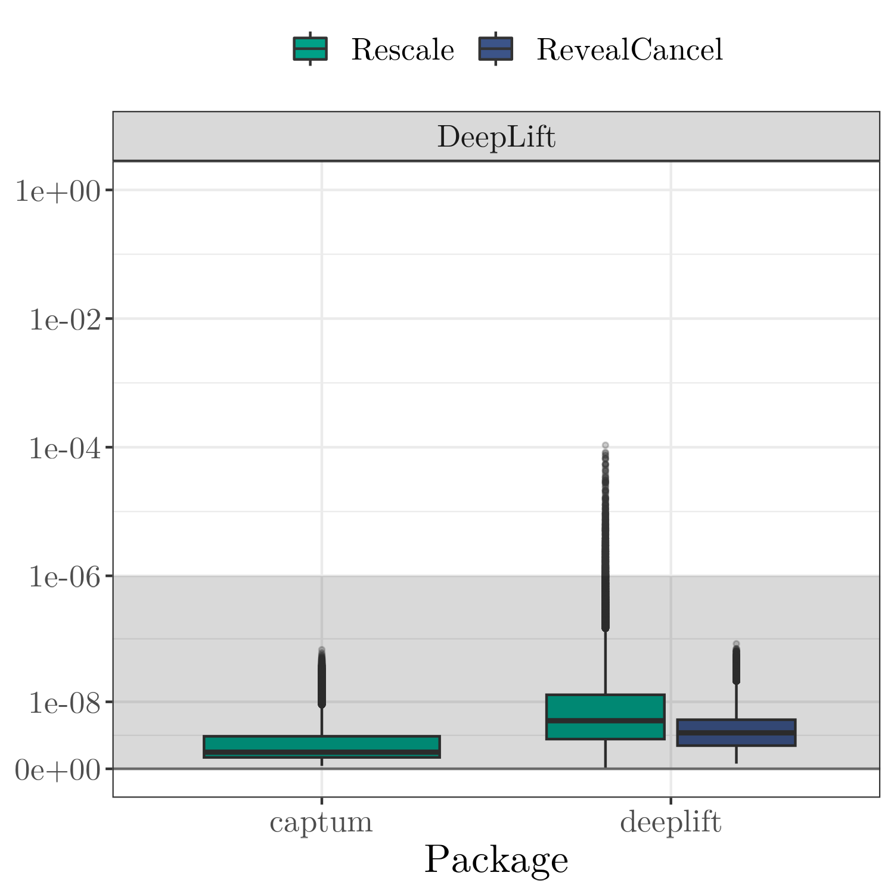 
  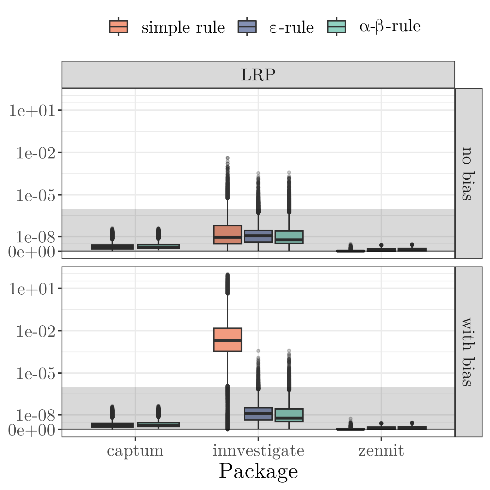
</p>

To start the simulation for the time measurement the following R script must 
be executed:

```
Rscript Section_5_2_and_Appendix_A.R
```

**Note:** Since this simulation takes a lot of time, it can be significantly 
reduced if fewer models than $20$ are created per architecture. This can be 
adjusted with the `num_models` value in the R script called above. In addition, 
the step size of the varying parameter can also be lowered, e.g., for the 
number of hidden layers, set `c(2, 25, 50)` instead of `c(2, seq(5, 50, by = 5))`.
(By default, the script uses a minimal time-consuming setting)

This creates the images for Figure 12 (a) and (b), 14, 15, 16, 17 and 18 from the
paper and places them in the folder `figures/`.

**Figure 12 (a)**
") 

**Figure 12 (b)**
")


<details>
<summary>Figures from Appendix A</summary>
<br>

**Figure 14**
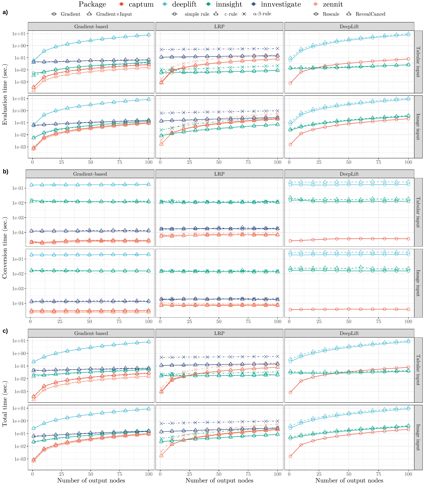

**Figure 15**
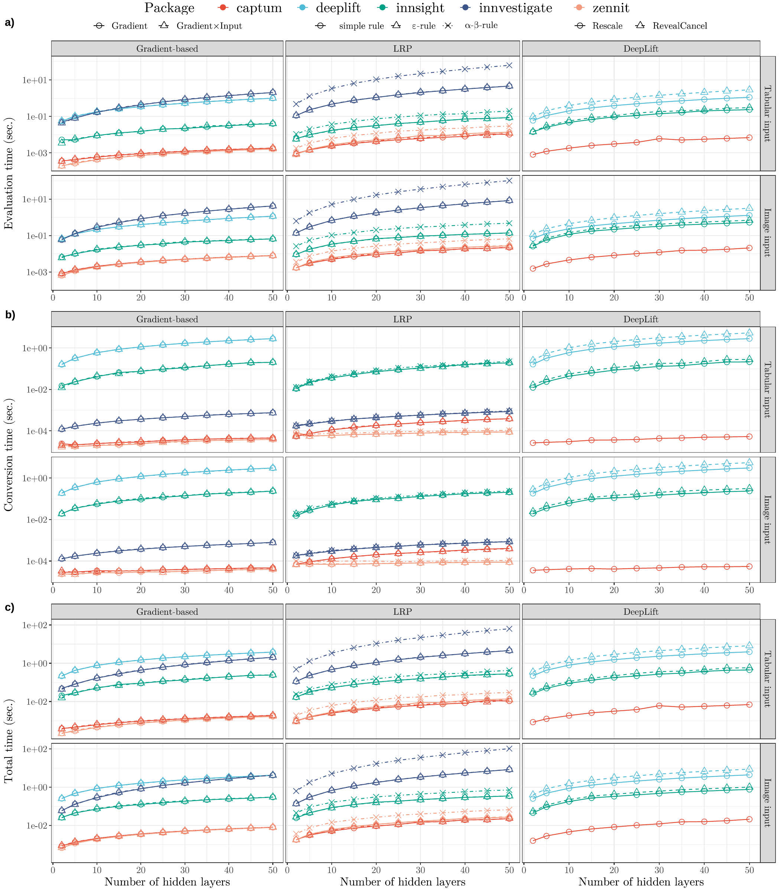

**Figure 16**
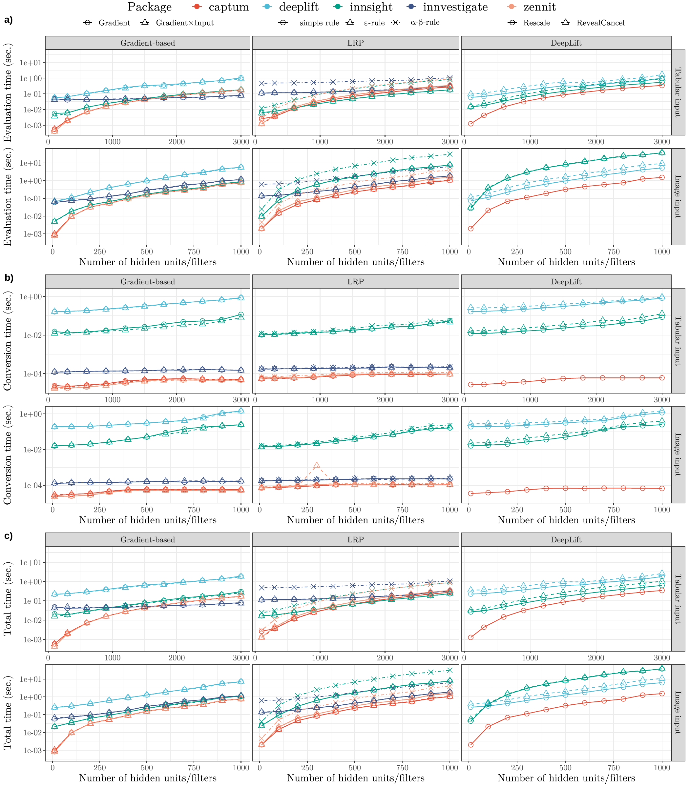

**Figure 17**
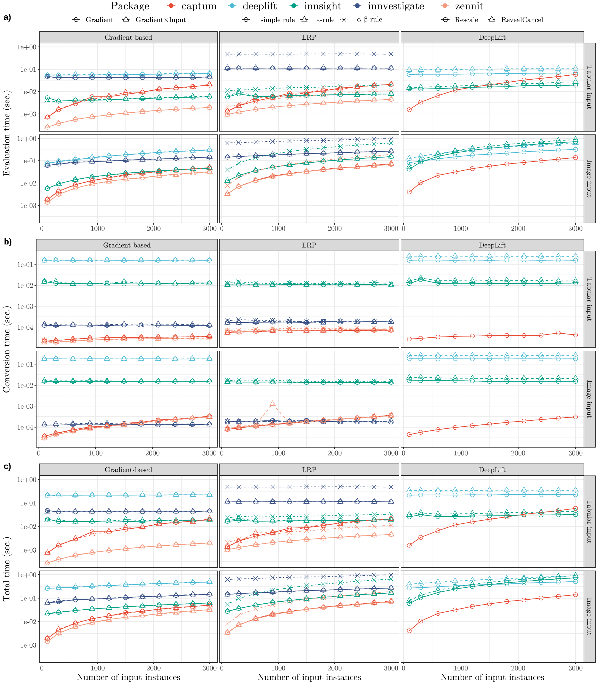

**Figure 18**
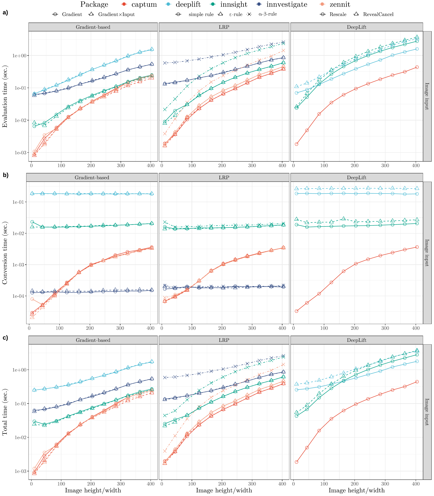
</details>

## Appendix B

The R script demonstrates the differences between **innsight** and **innvestigate** 
in the LRP &alpha;-&beta;-rule, which is explained in more detail in the paper 
in Appendix B. Run the following code

```
Rscript Appendix_B.R
```

that outputs

```r
── Results ─────────────────────────────────────────────────────────────────────

── iNNvestigate 
  epsilon_0.001 alpha_beta_1 alpha_beta_2  out
1     0.9868421            1            2 0.75

── innsight 
  epsilon_0.001 alpha_beta_1 alpha_beta_2  out
1     0.9868421    0.7499993     1.499999 0.75
```

