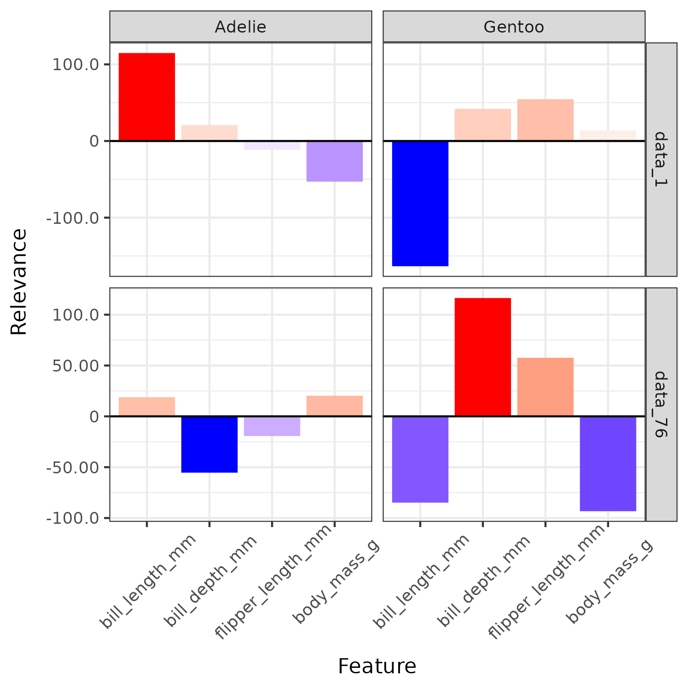
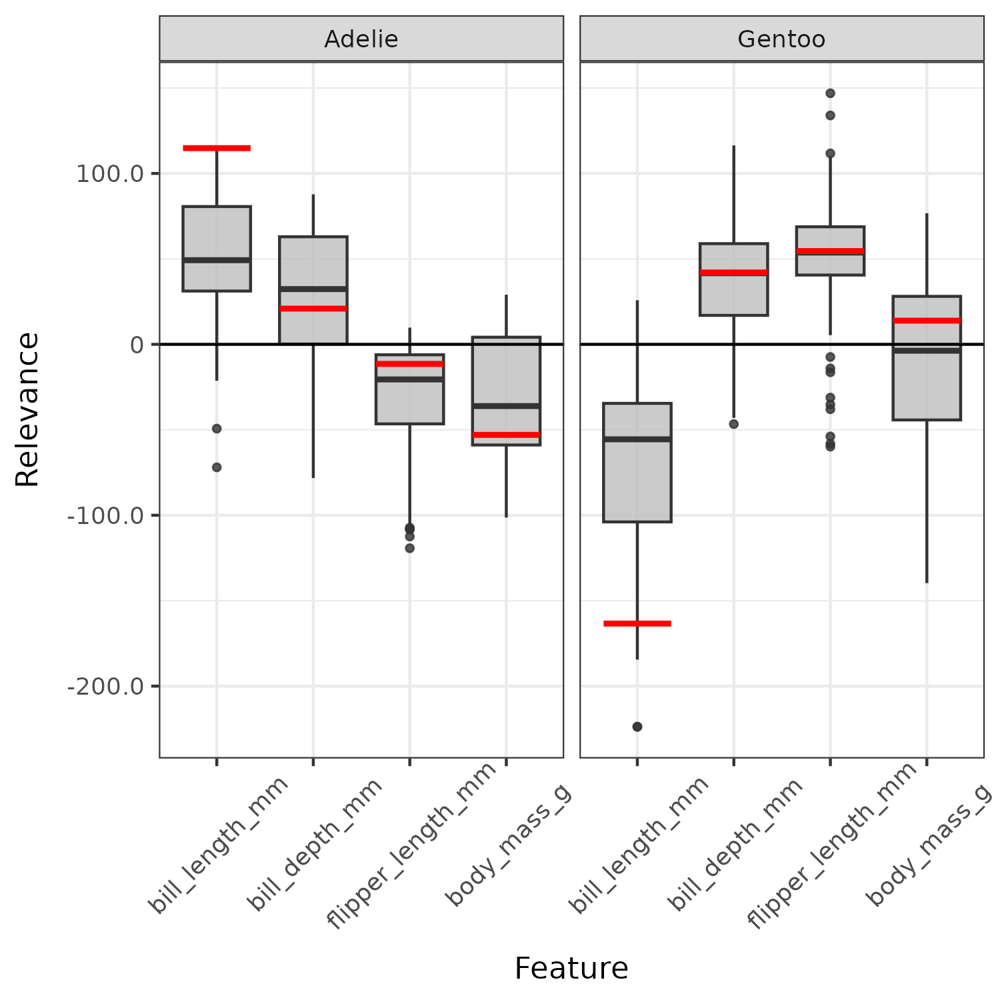
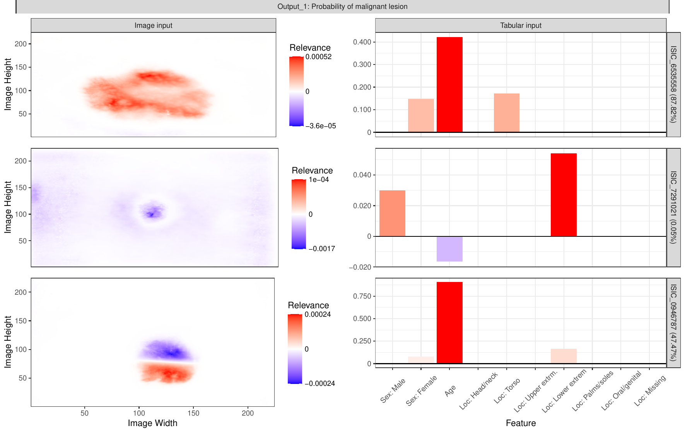
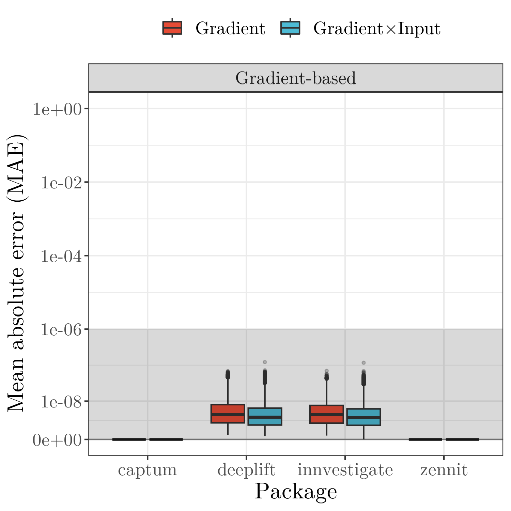
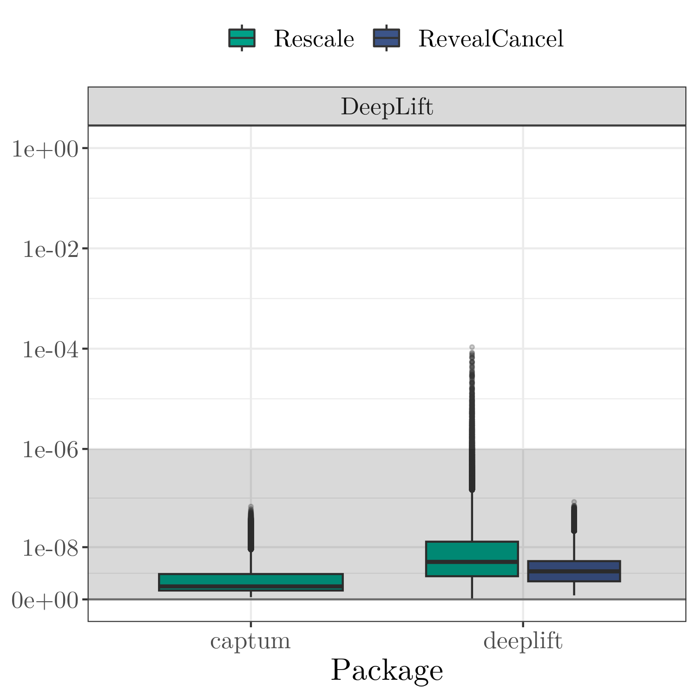
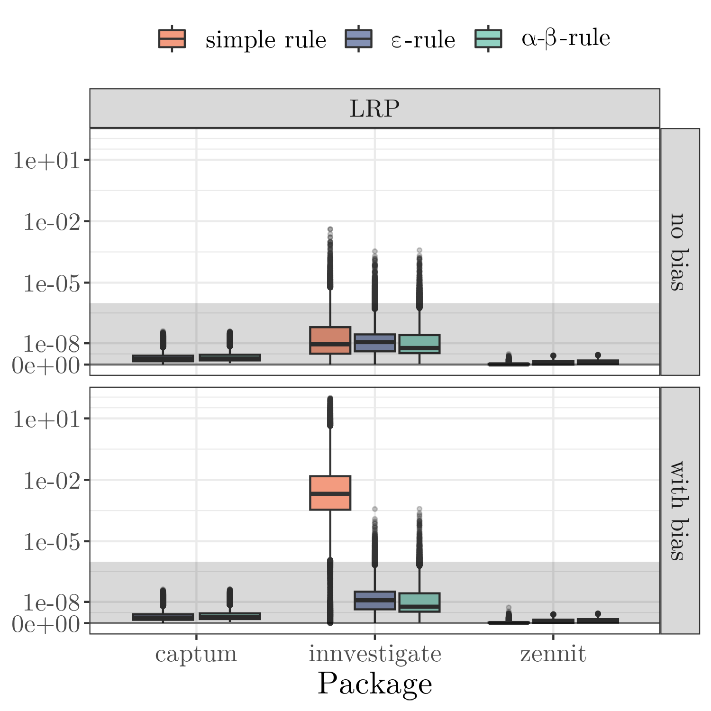
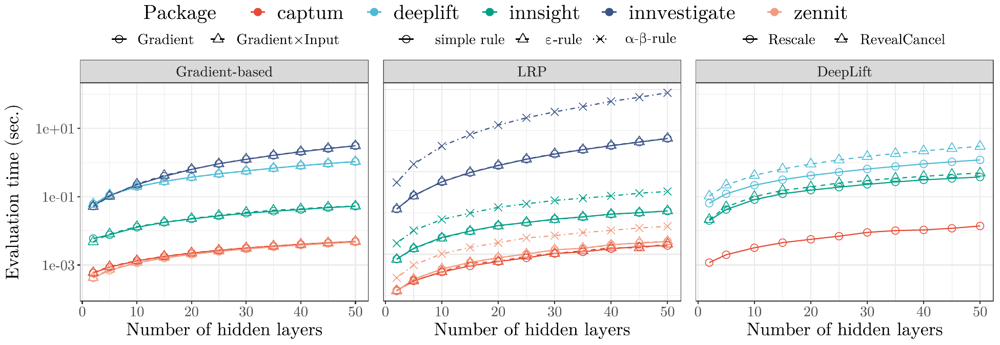
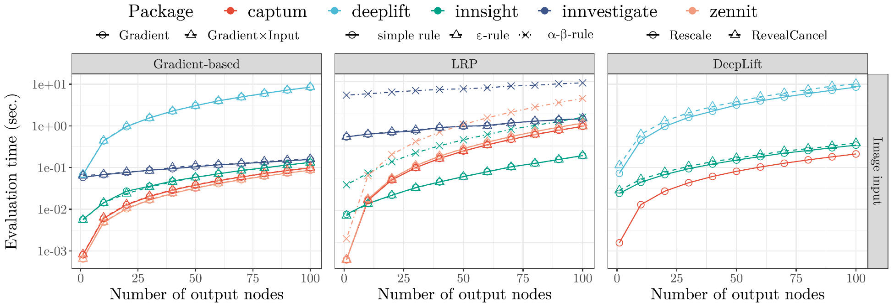

# Interpreting Deep Neural Networks with the Package `innsight`

This repository can be used to reproduce the results and figures from the 
paper *"Interpreting Deep Neural Networks with the Package innsight"* submitted 
for the Journal of Statistical Software (JSS). It is structured as follows:

* Folder `4_Illustration/` covers the example with the penguin dataset 
(only numerical input variables) and  the melanoma dataset (images and tabular 
inputs).

* Folder `5_Validation/` includes the simulation study of the implemented 
feature attribution methods regarding the correctness and runtime compared with
the reference implementations [**captum**](https://captum.ai/), 
[**zennit**](https://github.com/chr5tphr/zennit), [**innvestigate**](https://github.com/albermax/innvestigate), and 
[**deeplift**](https://github.com/kundajelab/deeplift).

* The `Appendix_B/` folder contains the code to reproduce the differences 
between **innsight** and **innvestigate** explained in Appendix B for the 
LRP $\alpha$-$\beta$-rule when a bias vector occurs in the model.

Since each reference implementation has different constraints on the 
provided deep learning library and the available packages, the computations 
occur in separated conda environments with the required packages and package 
versions. These conda environments can be created using the R script
`utils/create_condaenvs.R` and are essential for reproducing the 
results.

## Reproduction of the results

### 4.1. Example 1: Penguin dataset

In the first example, the penguin dataset provided by the 
[**palmerpenguins**](https://allisonhorst.github.io/palmerpenguins/) 
package is used and a neural network consisting of a dense layer is trained 
using the [**neuralnet**](https://cran.r-project.org/web/packages/neuralnet/neuralnet.pdf) 
package. To reproduce the results from the paper, run the R script `4_Illustrations/4_1_Palmerpenguins/4_1_Palmerpenguins.R` with the current directory as the working directory, e.g.,

```
Rscript 4_Illustrations/4_1_Palmerpenguins/4_1_Palmerpenguins.R
```

The Figure 7 used in the paper is then saved in the folder `4_Illustrations/4_1_Palmerpenguins/`.

 

### 4.2. Example 2: Melanoma dataset

The second example examines the melanoma dataset from the [Kaggle challenge](https://www.kaggle.com/competitions/siim-isic-melanoma-classification/overview/description) 
in 2020, issued by the society of imaging informatics in medicine (SIIM) and based
on the international skin imaging collaboration (ISIC) archive, the most 
extensive publicly available collection of quality-controlled dermoscopic 
images of skin lesions. This dataset consists of $33.126$ labeled images 
with associated patient-level contextual information, such as the age, gender, 
and image location of the skin lesion or mole. Since this is an extensive 
neural network and complicated high-dimensional data, the definition and 
training of the model is explained in more detail in the folder 
`4_Illustrations/4_2_Melanoma/`. To reproduce the results, the weights of the 
model stored at `4_Illustrations/4_2_Melanoma/checkpoints/model_224_224` are 
loaded and used. Then, execute the following R-script:

```
Rscript 4_Illustrations/4_2_Melanoma/step_1-3_innsight.R
```

This creates the images for Figure 9 from the paper and places them in 
the folder `4_Illustrations/4_2_Melanoma/figures/`.



### 5 Validation and runtime

In the paper, our package **innsight** was evaluated with the reference 
implementations **zennit**, **captum**, **innvestigate** and **deeplift** 
in terms of correctness of results and runtime on a simulation study with 
shallow untrained models. Each of these simulations takes quite a bit of 
time and must be started with this directory as the working directory. The exact 
details of this simulation can be found in the paper and the 
simulation is run to reproduce the results with the following command:

```
Rscript 5_Validation/5_1_Correctness/5_1_Correctness.R
```

This creates the images for Figure 10 from the paper and places them in 
the folder `5_Validation/5_1_Correctness/figures/`.

  

To start the simulation for the time measurement the following R script must 
be executed:

```
Rscript 5_Validation/5_2_Time/5_2_Time.R
```

This creates the images for Figure 12, 15, 16, 17, 18 and 19 from the paper 
and places them in the folder `5_Validation/5_2_Time/figures/`.

 


## Appendix B

The R script demonstrates the differences between **innsight** and **innvestigate** 
in the LRP $\alpha$-$\beta$-rule, which is explained in more detail in the paper 
in Appendix B. Run the following code

```
Rscript Appendix_B/appendix_B.R
```

that outputs

```r
── Results ─────────────────────────────────────────────────────────────────────

── iNNvestigate 
  epsilon_0.001 alpha_beta_1 alpha_beta_2  out
1     0.9868421            1            2 0.75

── innsight 
  epsilon_0.001 alpha_beta_1 alpha_beta_2  out
1     0.9868421    0.7499993     1.499999 0.75
```

